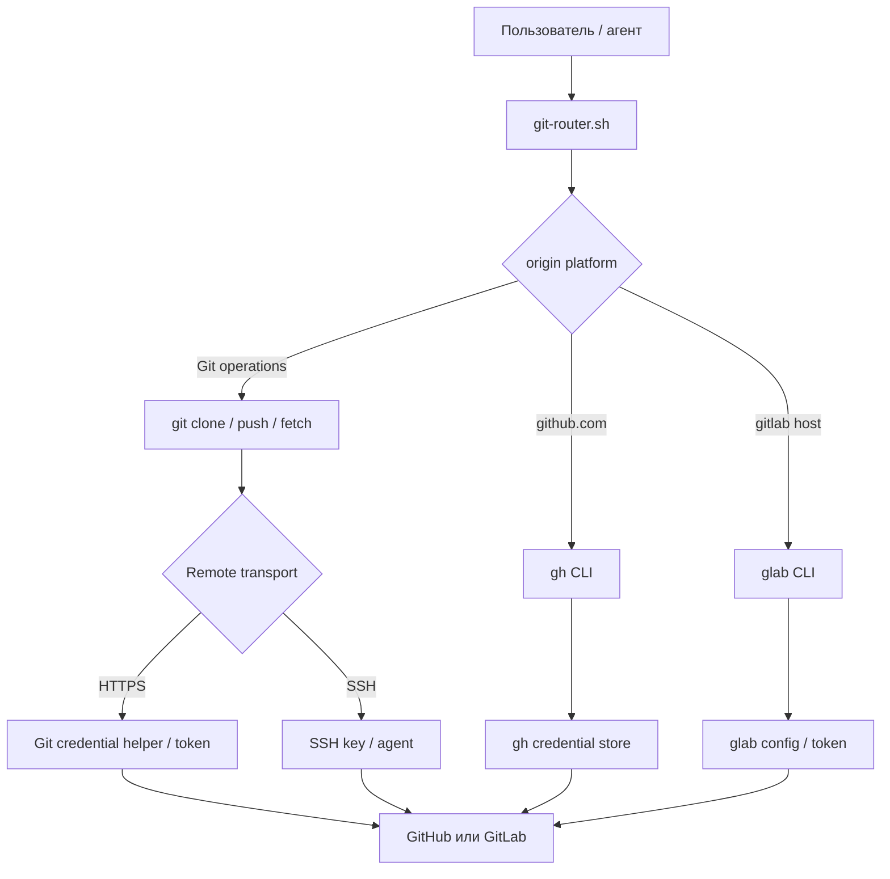

# Authentication в Git / GitHub / GitLab skill

> Технический briefing по реальному коду и документации репозитория. Анализ выполнен для ветки `main`, исходный commit `76f9c0300058bce0b8588b25c22852d6b6d1ca9e`.

## Главный вывод

Собственной authentication-системы в репозитории нет. Это operational skill и shell-router, делегирующий аутентификацию четырём внешним механизмам:

- Git over HTTPS → PAT и Git credential helper;
- Git over SSH → SSH key и SSH agent;
- GitHub API → `gh`;
- GitLab API → `glab`.

Здесь нет собственной пользовательской login-сессии, cookies или JWT прикладного backend.

## Компоненты

| Компонент | Роль в authentication |
|---|---|
| [`scripts/git-router.sh`](../scripts/git-router.sh) | Выбирает GitHub/GitLab по `origin`, вызывает `git`, `gh` или `glab`; сам токены не создаёт и не проверяет. |
| [`SKILL.md`](../SKILL.md#2-авторизация-на-платформах) | Описывает PAT, SSH, deploy/CI tokens и credential helpers. |
| [`references/10-gh-cli.md`](../references/10-gh-cli.md#установка-и-авторизация) | Login, status, refresh и logout для GitHub CLI. |
| [`references/11-glab-cli.md`](../references/11-glab-cli.md#установка-и-авторизация) | Login/status/logout и передача GitLab token. |
| [`references/05-git-config-hooks.md`](../references/05-git-config-hooks.md#автозамена-url) | Переключение HTTPS → SSH через `insteadOf` и `pushInsteadOf`. |
| [`references/12-security-cicd.md`](../references/12-security-cicd.md#секреты-и-переменные) | GitHub Actions secrets и их передача в reusable workflows. |
| [`tests/test-router.sh`](../tests/test-router.sh) | Локальные функциональные тесты; authentication-сценарии практически не покрыты. |

## Request flow

Платформа определяется чтением `git remote get-url origin` и поиском имени хоста в [`detect_remote_platform()`](https://github.com/symmora/git-github-gitlab-admin/blob/main/scripts/git-router.sh#L127-L139). PR, issue и release-команды затем напрямую вызывают `gh` или `glab`, например в [PR flow](https://github.com/symmora/git-github-gitlab-admin/blob/main/scripts/git-router.sh#L842-L873). Router не извлекает token и не создаёт собственный `Authorization` header.

## Жизненный цикл credentials и tokens

| Стадия | Реальное поведение |
|---|---|
| **Создание** | Router ничего не выпускает. PAT/deploy token создаётся на платформе; SSH key — внешней командой `ssh-keygen`. GitHub App JWT/installation token только описаны в [`08-github-platform.md`](../references/08-github-platform.md#github-apps--oauth-apps). |
| **Передача** | PAT может попасть в URL; GitHub token передаётся через stdin в `gh auth login --with-token`; GitLab token — через `--token`. См. [методы подключения](../SKILL.md#подключение-к-репозиториям--методы). |
| **Проверка** | Документация предлагает `gh auth status` и `glab auth status`, но router их перед операциями не вызывает. Фактическая проверка происходит при обращении к серверу. |
| **Обновление** | Для GitHub документированы `gh auth refresh` и изменение scopes. Автоматического refresh в router нет; для `glab` refresh-flow не описан. |
| **Хранение** | `credential.helper store` пишет HTTPS credentials в `~/.git-credentials`; `cache` держит их в памяти. `glab` показывает token в `~/.config/glab-cli/config.yml`. SSH private key находится вне репозитория; GitHub Actions secrets — на стороне GitHub. |
| **Удаление** | Документированы `gh auth logout` и `glab auth logout`. Отзыв PAT, удаление SSH key и комплексная очистка Git credential helper не описаны. |

## Существенные наблюдения

- `cmd_config` без выбора глобально включает `credential.helper store`: [`git-router.sh#L156-L187`](https://github.com/symmora/git-github-gitlab-admin/blob/main/scripts/git-router.sh#L156-L187). Это долговременное хранение credentials в открытом виде в `~/.git-credentials` и слабый default для security-oriented skill.
- Router проверяет наличие `gh`/`glab`, но не authenticated identity, host, scopes и срок действия token.
- Ошибки `gh repo create`/`glab repo create` подавляются через `2>/dev/null`: invalid token, недостаточный scope, конфликт имени и сетевой сбой выглядят одинаково ([код](https://github.com/symmora/git-github-gitlab-admin/blob/main/scripts/git-router.sh#L220-L240)).
- Token-in-URL может попасть в shell history, process listing, `.git/config` и логи.
- `echo "<token>" | gh auth login --with-token` способен оставить token в shell history.
- `gh auth status --show-token` раскрывает token в терминал и особенно рискован в automation/agent-контексте.
- Тесты не проверяют auth status, HTTPS helper, SSH transport, expired token и insufficient scopes ([покрытие](https://github.com/symmora/git-github-gitlab-admin/blob/main/tests/test-router.sh#L400-L431)).

## Неопределённости

- Репозиторий не показывает, что реально настроено на машине: SSH agent, OS keychain, `~/.git-credentials`, `GH_TOKEN` или конфигурация `gh`.
- Хранилище `gh` зависит от ОС и доступности системного credential store.
- Не описан приоритет между `GH_TOKEN`, `GITHUB_TOKEN`, `GITLAB_TOKEN`, CLI storage и Git credential helper.
- Scopes, expiration и rotation policy существуют вне репозитория и здесь не определяются.
- Утверждение, что `gh auth login` использует PAT, чрезмерно упрощает browser/device OAuth flow.
- GitHub App JWT и installation-token flow документированы, но реализации генерации JWT нет.
- Это operational authentication skill/router. Authentication прикладного приложения — users, sessions, cookies, JWT middleware — отсутствует.
